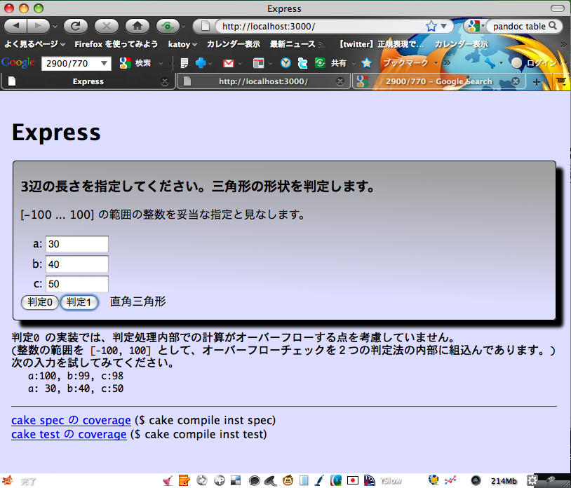
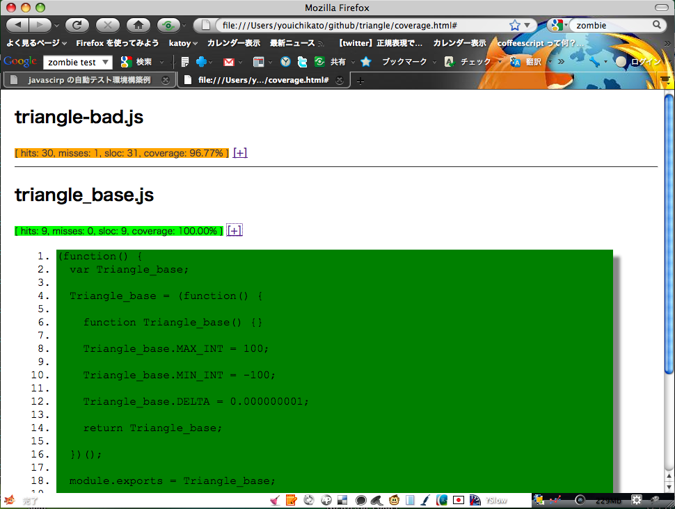
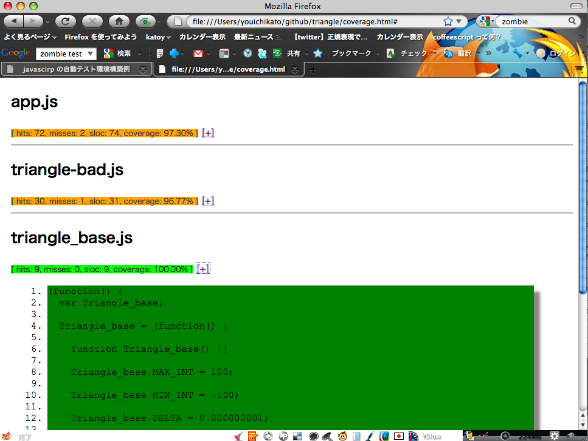

% javascirp の自動テスト環境構築例
% 20120-02-27 加藤洋一

# 目的 #
web アプリ、web サービスの自動テスト環境の構築例を示す。
手動テストの改善の検討資料とする。

# 自動化の効果概要 #

ここで試作した　web アプリが、リリースまでに１０回 プログラム変更されたとする。
各版でのテスト実施時間、テストに費やす時間を表にしてみた。

<table border='1'>
  <tr>
    <th>version</th>
    <th>現状の方法</th>
    <th>自動テスト環境</th>
	<th>備考</th>
  </tr>
  <tr>
    <td align='right'>0.1</td>
	<td>400 秒 (40 項目 * 10 秒)</td>
	<td>40 秒 (40 項目 * 1 秒)</td>
	<td>初期のテスト設計</td>
  </tr>
  <tr>
    <td align='right'>0.2</td>
	<td>100 秒 (10 項目 * 10 秒)</td>
	<td>50 秒 (50 項目 * 1 秒)</td>
	<td>テスト追加 10 件</td>
  </tr>
  <tr>
    <td align='right'>0.3</td>
	<td>100 秒 (10 項目 * 10 秒)</td>
	<td>60 秒 (60 項目 * 1 秒)</td>
	<td>テスト追加 10 件</td>
  </tr>
  <tr>
    <td align='right'>0.4</td>
	<td>100 秒 (10 項目 * 10 秒)</td>
	<td>70 秒 (70 項目 * 1 秒)</td>
	<td>テスト追加 10 件</td>
  </tr>
  <tr>
    <td align='right'>0.5</td>
	<td>100 秒 (10 項目 * 10 秒)</td>
	<td>80 秒 (80 項目 * 1 秒)</td>
	<td>テスト追加 10 件</td>
  </tr>
  <tr>
    <td align='right'>0.6</td>
	<td>800 秒 (80 項目 * 10 秒)</td>
	<td>80 秒 (80 項目 * 1 秒)</td>
	<td>全テストの実施</td>
  </tr>
  <tr>
    <td align='right'>0.7</td>
	<td>100 秒 (10 項目 * 10 秒)</td>
	<td> 90 秒 (80 項目 * 1 秒)</td>
	<td>テスト追加 10 件</td>
  </tr>
  <tr>
    <td align='right'>0.8</td>
	<td> 100 秒 (10 項目 * 10 秒)</td>
	<td> 100 秒 (100 項目 * 1 秒)</td>
	<td>テスト追加 10 件</td>
  </tr>
  <tr>
    <td align='right'>0.9</td>
	<td>1000 秒 (100 項目 * 10 秒)</td>
	<td> 100 秒 (100 項目 * 1 秒)</td>
	<td>全テスト実施</td>
  </tr>
  <tr>
    <td align='right'>1.0</td>
	<td> 100 秒 (10 項目 * 10 秒)</td>
	<td> 100 秒 (100 項目 * 1 秒)</td>
	<td>抜出しテスト 10件</td>
  </tr>
  <tr>
    <td align='right'>合計</td>
	<td><strong>2900 秒</strong></td>
	<td><strong> 770 秒</strong></td>
	<th></th>
  </tr>
</table>

　　＊　現状では 出荷する 1.0 版で、全テスト確認はできない。 
　　＊　現状では、途中の版でのデグレードが次版で見つからないケースがある。 
　　＊　自動テストでは、テスト時間中でも他の作業をすることができる。 
　　　　　(テスト失敗のアラームが上がるのを注意しているだけでよい)

　　効率アップ率:  2900 / 700 = <strong>3.76 倍</strong> 
　　　　　自動チェックでは実質時間はテスト結果のチェック時間 10 秒 + 10 回 = 100 秒とすれば、 
　　　　　　　　　 2900 / 100= <strong>29倍</strong> 

# テスト対象のアプリーケーション #

Web アプリ：
------------

web 画面の Form に３つの数字を入れると、 
　　その数字を辺の長さとして三角形をつくると　どのような形状になるか？ 
を画面に表示する。 
 
3 つの数字が入力されていなければ、 
　　　その旨をエラー 
　　　　入力されていない、数値が指定されていない etc... 
3 つの数字が入力されていれば、 
　　　直角三角形 
　　　２等辺三角形 
　　　一般に三角形 
　　　三角形を構成できない 
のいずれかを判定する。 
 
web 画面は HTML5 で記載されている。 
html form として３つの数値入力エリア、判定実行ボタンを配置する。 
判定実行ボタンをクリックすると、ajax 呼び出しでサーバーに３つの値を渡す。 
サーバーは３つの数字からの判定結果を返す。 
クライアント側はサーバーから返ってきた判定結果を画面に表示する。 

テスト内容
===========

サバーサイドのテスト：
-----------------------
サーバーサイドでは、ajax の処理先として 
　　　triangle.kind(a, b ,c) 
という javascritp の関数がある。 
　　(入力： a,b,c: 3 つの文字列, 
　　 返り値： 
　　　　　　'REGULAR': 一般の三角形, 'ISO': 二等辺三角形, 'RIGHT': 直角三角形 
　　　　　　'NG':  三角形を構成できない。 
　　　　　　'NG-INPUT': 入力文字列が不正 
 
この kind() を様々な引数で呼び出して、その返り値をテストする。  
 
 2 通りのテストを試作した。
　　1. cake spec
　　2. cake test
 
1. cake spec
------------

[vows](http://vowsjs.org/) を利用して、単体テストを行う。  
javascript で直接 kind() を呼び出してテストする。

コンソール画面で、１コマンド実行 (line 1) するだけで、テスト結果 (line 181) が得られる。 
処理時間は 1.3 秒である。 

　　　　　＊コンソールでの実行画面＊

~~~~~~~~~~~~~~~~~~~~~~~~~~~~~~~~~~~~~~~~~~ {.bash .numberLines}
$ cake spec
cake spec
vows runner loading [ '/Users/youichikato/github/triangle/spec/triangle-bad_spec', '/Users/youichikato/github/triangle/spec/triangle_spec' ]
vows runner running Triangle_bad:正数と０ 
♢ Triangle_bad:正数と０

  正数と０
    ✓ [0..4]  [0..4]  [0..4]
  直角三角形, その他
    ✗ 直角三角形, その他
    overflow! a^2 = 25, b^2 = 144, c^2 = 169, a^2 + b^2 = 169
  最大・最小の整数
    ✓ 最小の整数
    ✓ 最大の整数
  最大 - 1
    ✗ x
    overflow! a + b = 199, b + c = 200, c + a = 199

vows runner running Triangle:正数と０ 
♢ Triangle:正数と０

  正数と０
    ✓ [0..4]  [0..4]  [0..4]
  正数と０ 直角三角形, その他
    ✓ 直角三角形, その他
  正数と０ 最大・最小の整数
    ✓ 最小の整数
    ✓ 最大の整数
  正数と０ Triangle:最大 - 1
    ✓ x

vows runner finish 
✗ Errored » 8 honored ∙ 2 errored (0.006s)

real	0m1.305s
user	0m0.601s
sys	0m0.125s

~~~~~~~~~~~~~~~~~~~~~~~~~~~~~~~~~~~~~~~~~~~~

　　　　　＊コードカバレージ計測結果＊

自動テストの内容は、ここでは 2つの javascript で記載している。  
5 x 5 x 5 + 3 + 29  =157 ケースのテストをおこなっている。 

　　1. <a href="../spec/triangle_cases.coffee">spec/triangle_cases.coffee</a> 
　　2. <a href="../spec/triangle_cases.coffee">spec/triangle_spec.coffee</a>

1. <a href="../spec/triangle_cases.coffee">spec/triangle_cases.coffee</a> の内容

~~~~~~~~~~~~~~~~~~~~~~~~~~~~~~~~~~~~~~~~~~ {.coffeescript .numberLines}
class Triangle_cases
  # [0..4] x [0..4] x [0..4] の網羅テスト
  @cases_result_555 :  {
    '0,0,0': 'NG'
    , '0,0,1': 'NG'
    , '0,0,0': 'NG'
    , '0,0,1': 'NG'
    , '0,0,2': 'NG'
    , '0,0,3': 'NG'
    , '0,0,4': 'NG'
    , '0,1,0': 'NG'
    , '0,1,1': 'NG'
    , '0,1,2': 'NG'
    , '0,1,3': 'NG'
    , '0,1,4': 'NG'
    , '0,2,0': 'NG'
    , '0,2,1': 'NG'
    , '0,2,2': 'NG'
    , '0,2,3': 'NG'
    , '0,2,4': 'NG'
    , '0,3,0': 'NG'
    , '0,3,1': 'NG'
    , '0,3,2': 'NG'
    , '0,3,3': 'NG'
    , '0,3,4': 'NG'
    , '0,4,0': 'NG'
    , '0,4,1': 'NG'
    , '0,4,2': 'NG'
    , '0,4,3': 'NG'
    , '0,4,4': 'NG'

    , '1,0,0': 'NG'
    , '1,0,1': 'NG'
    , '1,0,2': 'NG'
    , '1,0,3': 'NG'
    , '1,0,4': 'NG'
    , '1,1,0': 'NG'
    , '1,1,1': 'REGULAR'
    , '1,1,2': 'NG'
    , '1,1,3': 'NG'
    , '1,1,4': 'NG'
    , '1,2,0': 'NG'
    , '1,2,1': 'NG'
    , '1,2,2': 'ISO'
    , '1,2,3': 'NG'
    , '1,2,4': 'NG'
    , '1,3,0': 'NG'
    , '1,3,1': 'NG'
    , '1,3,2': 'NG'
    , '1,3,3': 'ISO'
    , '1,3,4': 'NG'
    , '1,4,0': 'NG'
    , '1,4,1': 'NG'
    , '1,4,2': 'NG'
    , '1,4,3': 'NG'
    , '1,4,4': 'ISO'
    , '2,0,0': 'NG'
    , '2,0,1': 'NG'
    , '2,0,2': 'NG'
    , '2,0,3': 'NG'
    , '2,0,4': 'NG'
    , '2,1,0': 'NG'
    , '2,1,1': 'NG'
    , '2,1,2': 'ISO'
    , '2,1,3': 'NG'
    , '2,1,4': 'NG'
    , '2,2,0': 'NG'
    , '2,2,1': 'ISO'
    , '2,2,2': 'REGULAR'
    , '2,2,3': 'ISO'
    , '2,2,4': 'NG'
    , '2,3,0': 'NG'
    , '2,3,1': 'NG'
    , '2,3,2': 'ISO'
    , '2,3,3': 'ISO'
    , '2,3,4': 'NORMAL'
    , '2,4,0': 'NG'
    , '2,4,1': 'NG'
    , '2,4,2': 'NG'
    , '2,4,3': 'NORMAL'
    , '2,4,4': 'ISO'
    , '3,0,0': 'NG'
    , '3,0,1': 'NG'
    , '3,0,2': 'NG'
    , '3,0,3': 'NG'
    , '3,0,4': 'NG'
    , '3,1,0': 'NG'
    , '3,1,1': 'NG'
    , '3,1,2': 'NG'
    , '3,1,3': 'ISO'
    , '3,1,4': 'NG'
    , '3,2,0': 'NG'
    , '3,2,1': 'NG'
    , '3,2,2': 'ISO'
    , '3,2,3': 'ISO'
    , '3,2,4': 'NORMAL'
    , '3,3,0': 'NG'
    , '3,3,1': 'ISO'
    , '3,3,2': 'ISO'
    , '3,3,3': 'REGULAR'
    , '3,3,4': 'ISO'
    , '3,4,0': 'NG'
    , '3,4,1': 'NG'
    , '3,4,2': 'NORMAL'
    , '3,4,3': 'ISO'
    , '3,4,4': 'ISO'
    , '4,0,0': 'NG'
    , '4,0,1': 'NG'
    , '4,0,2': 'NG'
    , '4,0,3': 'NG'
    , '4,0,4': 'NG'
    , '4,1,0': 'NG'
    , '4,1,1': 'NG'
    , '4,1,2': 'NG'
    , '4,1,3': 'NG'
    , '4,1,4': 'ISO'
    , '4,2,0': 'NG'
    , '4,2,1': 'NG'
    , '4,2,2': 'NG'
    , '4,2,3': 'NORMAL'
    , '4,2,4': 'ISO'
    , '4,3,0': 'NG'
    , '4,3,1': 'NG'
    , '4,3,2': 'NORMAL'
    , '4,3,3': 'ISO'
    , '4,3,4': 'ISO'
    , '4,4,0': 'NG'
    , '4,4,1': 'ISO'
    , '4,4,2': 'ISO'
    , '4,4,3': 'ISO'
    , '4,4,4': 'REGULAR'
  }

  # 直角三角形、その他
  @cases_result_misc_0 :  [
      [90,90,90,   'REGULAR']
    , [90,90,1,    'ISO']
    , [90,45,45,   'NG']
    ]

  @cases_result_misc_1 :  [
      [3,4,5,      'RIGHT']
    , [5,12,13,    'RIGHT']
    , [6,8,10,     'RIGHT']
    , [7,24,25,    'RIGHT']
    , [8,15,17,    'RIGHT']
    , [9,12,15,    'RIGHT']
    , [9,40,41,    'RIGHT']
    , [10,24,26,   'RIGHT']
    , [11,60,61,   'RIGHT']
    , [12,16,20,   'RIGHT']
    , [12,35,37,   'RIGHT']
    , [13,84,85,   'RIGHT']
    , [14,48,50,   'RIGHT']
    , [15,20,25,   'RIGHT']
    , [15,36,39,   'RIGHT']
    , [15,112,113, 'NG-INPUT'] # RIBHT
    , [16,63,65,   'RIGHT']
    , [17,144,145, 'NG-INPUT'] # RIGHT
    , [18,24,30,   'RIGHT']
    , [18,80,82,   'RIGHT']
    , [19,180,181, 'NG-INPUT'] # RIGHT
    , [20,21,29,   'RIGHT']
    , [20,48,52,   'RIGHT']
    , [20,99,101,  'NG-INPUT']
    , [21,28,35,   'RIGHT']
    , [21,72,75,   'RIGHT']
    , [22,120,122, 'NG-INPUT'] # RIGHT
    , [24,32,40,   'RIGHT']
    , [24,45,51,   'RIGHT']
    , [24,70,74,   'RIGHT']
    , [24,143,145, 'NG-INPUT'] # RIGHT
    , [25,60,65,   'RIGHT']
    , [26,168,170, 'NG-INPUT'] # RIGHT
    , [27,36,45,   'RIGHT']
    , [27,120,123, 'NG-INPUT'] # RIGHT
    , [28,45,53,   'RIGHT']
    , [28,96,100,  'RIGHT']
    , [28,195,197, 'NG-INPUT'] # RIGHT
    , [30,40,50,   'RIGHT']
  ]

module.exports = Triangle_cases

#--- End of File ---
~~~~~~~~~~~~~~~~~~~~~~~~~~~~~~~~~~~~~~~~~~~~

2. <a href="../spec/triangle_test_1.coffee">spec/triangle_test_1.coffee</a> の内容

~~~~~~~~~~~~~~~~~~~~~~~~~~~~~~~~~~~~~~~~~~ {.coffeescript .numberLines}
vows = require 'vows'
assert = require 'assert'
Triangle = require '../src/triangle'
Triangle_cases = require './triangle_cases'

ans = (a,b,c) ->
  # cases_result_555["#{a},#{b},#{c}"]
  Triangle_cases.cases_result_555[[a,b,c]]

vows.describe('Triangle:正数と０')
.addBatch
  "正数と０":
    topic: () ->
      @triangle = new Triangle

    '[0..4] * [0..4] * [0..4]': (err, browser, status) ->
      for a in [0..4]
        for b in [0..4]
          for c in [0..4]
            # kind() の結果をチェックする。
            assert.equal("0 #{a},#{b},#{c}:#{@triangle.kind(a, b ,c)}", "0 #{a},#{b},#{c}:#{ans(a,c,b)}")

            # a,b,c の順番に kind() が依存していないことをチェックする
            assert.equal("1 #{a},#{b},#{c}:#{@triangle.kind(a, b ,c)}", "1 #{a},#{b},#{c}:#{@triangle.kind(a,c,b)}")
            assert.equal("2 #{a},#{b},#{c}:#{@triangle.kind(a, b ,c)}", "2 #{a},#{b},#{c}:#{@triangle.kind(b,a,c)}")
            assert.equal("3 #{a},#{b},#{c}:#{@triangle.kind(a, b ,c)}", "3 #{a},#{b},#{c}:#{@triangle.kind(b,c,a)}")
            assert.equal("4 #{a},#{b},#{c}:#{@triangle.kind(a, b ,c)}", "4 #{a},#{b},#{c}:#{@triangle.kind(c,a,b)}")
            assert.equal("5 #{a},#{b},#{c}:#{@triangle.kind(a, b ,c)}", "5 #{a},#{b},#{c}:#{@triangle.kind(c,b,a)}")

    "直角三角形, その他":
      topic: () ->
        @triangle = new Triangle()

      '直角三角形, その他': (err, browser, status) ->
        for [a,b,c,kind] in Triangle_cases.cases_result_misc_0
          # a,b,c の順番に kind() が依存していないことをチェックする
          assert.equal("1 #{a},#{b},#{c}:#{@triangle.kind(a, b, c)}", "1 #{a},#{b},#{c}:#{kind}")
          assert.equal("2 #{a},#{b},#{c}:#{@triangle.kind(a, c, b)}", "2 #{a},#{b},#{c}:#{kind}")
          assert.equal("3 #{a},#{b},#{c}:#{@triangle.kind(b, a, c)}", "3 #{a},#{b},#{c}:#{kind}")
          assert.equal("4 #{a},#{b},#{c}:#{@triangle.kind(b, c, a)}", "4 #{a},#{b},#{c}:#{kind}")
          assert.equal("5 #{a},#{b},#{c}:#{@triangle.kind(c, a, b)}", "5 #{a},#{b},#{c}:#{kind}")
          assert.equal("6 #{a},#{b},#{c}:#{@triangle.kind(c, b, a)}", "6 #{a},#{b},#{c}:#{kind}")

      '直角三角形, その他': (err, browser, status) ->
        for [a,b,c,kind] in Triangle_cases.cases_result_misc_1
          # a,b,c の順番に kind() が依存していないことをチェックする
          assert.equal("1 #{a},#{b},#{c}:#{@triangle.kind(a, b, c)}", "1 #{a},#{b},#{c}:#{kind}")
          assert.equal("2 #{a},#{b},#{c}:#{@triangle.kind(a, c, b)}", "2 #{a},#{b},#{c}:#{kind}")
          assert.equal("3 #{a},#{b},#{c}:#{@triangle.kind(b, a, c)}", "3 #{a},#{b},#{c}:#{kind}")
          assert.equal("4 #{a},#{b},#{c}:#{@triangle.kind(b, c, a)}", "4 #{a},#{b},#{c}:#{kind}")
          assert.equal("5 #{a},#{b},#{c}:#{@triangle.kind(c, a, b)}", "5 #{a},#{b},#{c}:#{kind}")
          assert.equal("6 #{a},#{b},#{c}:#{@triangle.kind(c, b, a)}", "6 #{a},#{b},#{c}:#{kind}")

 ... 省略 ...
~~~~~~~~~~~~~~~~~~~~~~~~~~~~~~~~~~~~~~~~~~~~

2. cake test
------------
 
こちらの場合は, [zombie](http://zombie.labnotes.org/) という HTTP-client を利用して、 
　　　html フォームでの値設定、ajax 呼び出し、返り値の取得をする 
という操作をを通じて kind() を呼び出してテストする。 

コンソール画面で、１コマンド実行 (line 1) するだけで、テスト結果 (line 181) が得られる。 
処理時間は 1.5 秒である。 

　　　　　＊コンソールでの実行画面＊

~~~~~~~~~~~~~~~~~~~~~~~~~~~~~~~~~~~~~~~~~~ {.bash .numberLines}
$ ake test
Express server listening on port 3003 in development mode

♢ test for triangle_bad
  check get_method
    ✓ get [1 1 1]
  check empty press
    ✓ see result
  check 3 4 5 [3 4 5]
    ✓ see result
  check 1 1 2 [1 1 2]
    ✓ see result
  check 2 2 1 [2 2 1]
    ✓ see result
  check 2 3 4 [2 3 4]
    ✓ see result
  check 2 3 101 [2 3 101]
    ✓ see result
  check 30 40 50 [30 40 50]
    ✓ see result
  check 51 52 53 [51 52 53]
    ✓ see result
  check 1.2 10 10 [1.2 10 10]
    ✓ see result
  check 1 1 1 [1 1 1]
    ✓ see result
  check 10 1.2 10 [10 1.2 10]
    ✓ see result
  check 10 10 1.2 [10 10 1.2]
    ✓ see result
 
♢ test for triangle
  check get_method
    ✓ get [1 1 1]
  check empty press
    ✓ see result
  check 1 1 1 [1 1 1]
    ✓ see result
  check 3 4 5 [3 4 5]
    ✓ see result
  check 1 1 2 [1 1 2]
    ✓ see result
  check 2 2 1 [2 2 1]
    ✓ see result
  check 2 3 4 [2 3 4]
    ✓ see result
  check 2 3 101 [2 3 101]
    ✓ see result
  check 30 40 50 [30 40 50]
    ✓ see result
  check 51 52 53 [51 52 53]
    ✓ see result
  check 10 1.2 10 [10 1.2 10]
    ✓ see result
  check 10 10 1.2 [10 10 1.2]
    ✓ see result
  check 1.2 10 10 [1.2 10 10]
    ✓ see result
 
✓ OK » 26 honored (1.468s)

real	0m1.633s
user	0m1.322s
sys	0m0.174s
~~~~~~~~~~~~~~~~~~~~~~~~~~~~~~~~~~~~~~~~~~~~

　　　　　＊コードカバレージ計測結果＊

1. <a href="../test/triangle_test_1.coffee">test/triangle_test_1.coffee</a> の内容

~~~~~~~~~~~~~~~~~~~~~~~~~~~~~~~~~~~~~~~~~~ {.coffeescript .numberLines}
# 三角形の形状判定

vows = require 'vows'
assert = require 'assert'
zombie = require 'zombie'
# app = require '../src/app'
singleton_app = require './app_singleton'
app = singleton_app.get()

# Start server for test.
app.start()

port = app.port
baseUrl = "http://localhost:#{port}"

# get_result =  (window) ->
#   window.querySelector('#result')

new_browser = () ->
  browser = new zombie.Browser({ debug: false })
  browser.runScripts = true
  browser.waitFor = 3000
  browser

vows.describe("test for triangle")
.addBatch
  "check empty":
    topic: () ->
      new_browser().visit baseUrl, @callback
    'press':
      topic: (browser) ->
        browser.pressButton('#my_submit_1', @callback)
      "see result" : (browser) ->
        assert.equal(browser.text('#result'), 'a:empty b:empty c:empty ')

  "check 1 1 1":
    topic: () ->
      new_browser().visit baseUrl, @callback
    '[1 1 1]':
      topic: (browser) ->
        browser.
          fill('data_a', '1'). fill('data_b', '1').fill('data_c', '1').
          pressButton('#my_submit_1', @callback)
      "see result" : (browser) ->
        assert.equal(browser.text('#result'), '正三角形')

  "check 3 4 5":
    topic: () ->
      new_browser().visit baseUrl, @callback
    '[3 4 5]':
      topic: (browser) ->
        browser.
          fill('data_a', '3').fill('data_b', '4').fill('data_c', '5').
          pressButton('#my_submit_1', @callback)
      "see result" : (browser) ->
        assert.equal(browser.text('#result'), '直角三角形')

  "check 1 1 2":
    topic: () ->
      new_browser().visit baseUrl, @callback
    '[1 1 2]':
      topic: (browser) ->
        browser.
          fill('data_a', '1').fill('data_b', '1').fill('data_c', '2').
          pressButton('#my_submit_1', @callback)
      "see result" : (browser) ->
        assert.equal(browser.text('#result'), '三角形が作れません')

  "check 2 2 1":
    topic: () ->
      new_browser().visit baseUrl, @callback
    '[2 2 1]':
      topic: (browser) ->
        browser.
          fill('data_a', '2').fill('data_b', '2').fill('data_c', '1').
          pressButton('#my_submit_1', @callback)
      "see result" : (browser) ->
        assert.equal(browser.text('#result'), '二等辺三角形')

... 諸略 ...
~~~~~~~~~~~~~~~~~~~~~~~~~~~~~~~~~~~~~~~~~~~~

クライアントサイドのテスト：
----------------------------

テスト実行方法
===============
環境の詳細説明
==============

Cakefile 
  Makefile のようなもの。処理内容は coffeescrpt で記載する。
  $ cake で、実行出来るコマンドの一覧が表示される。

~~~~~~~~~~~~~~~~~~~~~~~~~~~~~~~~~~~~~~~~~~ {.coffeescript .numberLines}
$ cake
Cakefile defines the following tasks:

cake count                # how much files (*.coffee, *.js, *~)
cake compile              # Compile *.coffee
cake clean                # Clean compiled *.js *~
cake run                  # run application
cake setup                # setup node-modules
cake spec                 # spec
cake test                 # test and overage
cake inst                 # inst
cake test-client          # test-client
cake test-jsTestDriver    # jsTestDriver
cake test-phantomjs       # phantomjs
cake lint                 # lint
cake make-docs            # make docs/*.html, *.epub
cake clean-docs           # clean gnerated docs/*

  -e, --environment  set the environment for `task:run` (production|development, default=development)
  -p, --port         set the port for `task:run` (default=3000)
~~~~~~~~~~~~~~~~~~~~~~~~~~~~~~~~~~~~~~~~~~~

1. cake count 
　　　*.coffe, *.js. *~ のファイル数を数える。
2. cake compile 
　　　*.coffee を *.js にコンパイルする。
3. cake clean 
	　*.coffee の　compile 結果や *~ ファイルを削除する。
4. cake run 
　　　web アプリを起動する。(停止は ctrl-C で)
5. cake setup 
　　　外部ライブラリーを download する。 
　　　./node_modules 以下に保存さあれる。 
　　　./package.json にライブラリー一覧の情報がある。
6. cake spec 
　　　サーバーサイドの単体テストを実行する。
7. cake test 
　　　http-client 経由で、サーバーサイドの単体テストを実行する。
8. cake inst 
　　　*.js ファイルにコードカバレージ計測のコードを埋め込む。
9. cake test-client 
　　　クライアントサイドのテストを行う。(qunitを利用)
10. cake test-jsTestDriver 
　　　クライアントサイドのテストを行う。(jsTestDriverを利用)
11. cake test-phantomjs 
　　　クライアントサイドのテストを行う。(phantomjsを利用)
12. cake lint 
　　　*.coffee の lint チェックを行う。
13. cake make-docs 
　　　docs/readme.md から html5 形式, epub 形式のドキュメントを生成する。
14. cake clean-docs 
　　　docs/ 以下にある html形式, epub 形式のファイルを削除する。

TODO
-----
　* jenkies などの CI ツールと組み合わせる。
　* サーバーサイド、クライアントサイドの　coffe, js ファイルの API ドキュメントを生成する。
//--- End of File ---

