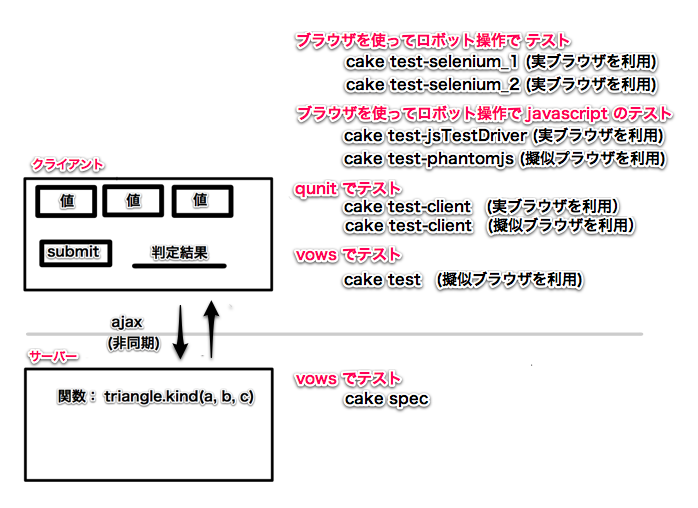

% javascript の自動テスト環境構築例
% 加藤洋一
  youichikato@gmail.com
% &copy; 2012

<h4>
2012-02-19 加藤洋一 加筆・校正 
2012-02-27 加藤洋一 作成開始 
</h4>
# 目的 #
web アプリ、web サービスの自動テスト環境の構築例を示す。  
手動テストの改善の検討資料とする。  

　　　　　　**＜＜目次＞＞**  
　[自動化の効果概要](#自動化の効果概要)  
　　　[成果物の比較](#成果物の比較)  
　　　[自動テストの利点](#自動テストの利点)  
　　　[自動テストの不利な点](#自動テストの不利な点)  
　[品管のテスト自動化推進の進め方への提案](#品管のテスト自動化推進の進め方への提案)  
　　　[プロセス改善の進め方](#プロセス改善の進め方)  
　[自動テストの環境構築/手法例](#自動テストの環境構築/手法例)  
　　　[テスト対象のアプリーケーション](#テスト対象のアプリーケーション)  
　　　[テスト内容](#テスト内容)  
　　　[サーバーサイド上でのテスト](#サーバーサイド上でのテスト)  
　　　　　[cake spec](#cake spec)  
　　　[クライアントからのテスト](#クライアントからのテスト)  
　　　　[cake test](#cake test)  
　　　　　[qunit を使う](#qunit を使う)  
　　　　　　　[実ブラウザ上で実行](#実ブラウザ上で実行)  
　　　　　　　　　[cake test-client](#cake test-client)  
　　　　　　　[擬似ブラウザ上で実行](#擬似ブラウザ上で実行)  
　　　　　　　　　[cake test-client-phantimjs](#cake test-client-phantimjs)  
　　　　　[cake test-phantomjs](#cake test-phantomjs)  
　　　　　[cake test-jsTestDriver](#cake test-jsTestDriver)  
　　　　　[Selenium の利用](#Selenium の利用)  
　　　　　　　　　[cake test-selenium_1](#cake test-selenium_1)  
　　　　　　　　　[cake test-selenium_2](#cake test-selenium_1)  
　　　　[テスト実行方法](#テスト実行方法)  
　[参考](#参考)  

<a name="自動化の効果概要" />

# 自動化の効果概要 #

<a name="成果物の比較" />

成果物の比較
------------
　　　　現状：  
　　　　　　仕様書、プログラム、開発内テスト(チェックシートとテスト結果)  
　　　　　　品管のテスト (チェックシートとテスト結果)  

　　　　自動テストを導入した場合：  
　　　　　　仕様書、プログラム、開発内テスト(チェック仕様書、**テストプログラム**、**テスト実施ログ** )  
　　　　　　品管のテスト (チェックシートとテスト結果)  
　　　　　　　(品管が作成した自動テストは開発内テストに全て取り込まれていく。  
　　　　　　　 品管のテストは、最終的には手動テストのものだけとなる。)  
　　　　　　　 今回のアプリの例では、様々な値に対する判定結果のテストは全て自動化される。  
　　　　　　　 手動テストでは、画面の様々なエフェクト を扱うものだけとなるだろう。  
　　　　　　　 (入力フォームのウォーターマークの様子、画面レイアウト、画面改造像の差の影響,  
　　　　　　　　キー・マウス操作, IME 操作 etc...)  

<a name="自動テストの利点" />

自動テストの利点
-----------------
　　　　1. 全ての版に全テストを実施できる。  
　　　　2. 誰もが何時でもテストを実施できる。さらにチェック結果の判断ミスが発生しない。  
　　　　　　現状では、テスト結果(チェックシートのテスト結果) を第３者が再チェックすることは困難。  
　　　　　　(テスト環境を構築した上で、さらに同等の時間を費やせねばならない為)  
　　　　3. テストに掛かった時間を正確に計測できる。  
　　　　　　(テストを繰り返す際に、正確な時間見積もりが可能となる。)  
　　　　　　現状では１パス実行に何時間かかったかが記録されていない。  
　　　　　　１パスを全て実行するのに必要な工数を第三者が正確に見積れない。  
　　　　4. 効率がアップする。  
　　　　　　効率アップ率: 　 2900 / 770 = <strong>3.76 倍</strong>  
　　　　　　自動チェックでは実質時間は、テスト結果のチェック時間 10 秒 + 10 回 = 100 秒程度となる。  
　　　　　　その数値で計算した場合は、  
　　　　　　　　　 2900 / 100= **29倍**  
　　　　　　となる。  
　　　　5. テストカバレッジという指標で、テストプログラム自体を評価することができる。  
　　　　　　　現状のチェックシート + 手動テストでは、網羅性を客観的に判断できない。  
　　　　6. 品管のテスト項目の観点を、  
　　　　　　　　機能チェック　⇒ ユーザー観点チェク  
　　　　　 にシフトさせることができる。  
　　　　　 現状で単体テストレベルのことのテストに費やしていた時間を、  
　　　　　 全体のデザインの統一、ユーザービリティなどの観点のチェックに回すことができる。  
　　　　7. デグレードを恐れて 改善・変更を見送ること が少なくなる。  
　　　　　　　（基本動作に副作用が生じていないかを、漏れなく短時間で何度でもチェックが可能になるので）  

#### 効率アップ率の試算例 ####
web アプリに、リリースまでに１０回 のプログラム変更が行われたとする。  
その場合の各版でのテスト実施時間、テストに費やす時間を表にしてみた。  

-----------------------------------------------------------------------------------------------
       version   現状の方法                   自動テスト環境              備考
-------------- ------------------------------ --------------------------- ---------------------
           0.1 400 秒 (40 項目 * 10 秒)       40 秒 (40 項目 * 1 秒)      初期のテスト設計

           0.2 100 秒 (10 項目 * 10 秒)       50 秒 (50 項目 * 1 秒)      テスト追加 10 件

           0.3 100 秒 (10 項目 * 10 秒)       60 秒 (60 項目 * 1 秒)      テスト追加 10 件 

		   0.4 100 秒 (10 項目 * 10 秒)       70 秒 (70 項目 * 1 秒)      テスト追加 10 件 

		   0.5 100 秒 (10 項目 * 10 秒)       80 秒 (80 項目 * 1 秒)      テスト追加 10 件 

		   0.6 800 秒 (80 項目 * 10 秒)       80 秒 (80 項目 * 1 秒)      **全テストの実施**

		   0.7 100 秒 (10 項目 * 10 秒)       90 秒 (80 項目 * 1 秒)      テスト追加 10 件 

		   0.8 100 秒 (10 項目 * 10 秒)       100 秒 (100 項目 * 1 秒)    テスト追加 10 件 

		   0.9 1000 秒 (100 項目 * 10 秒)     100 秒 (100 項目 * 1 秒)    **全テスト実施** 

		   1.0 100 秒 (10 項目 * 10 秒)       100 秒 (100 項目 * 1 秒)    **現状：抜出しテスト 10件**
                                                                          **自動テスト：全テスト 100件**

     **Total** **2900 秒 (290 項目 * 10 秒)** **770 秒(770 項目 * 1 秒)**
-----------------------------------------------------------------------------------------------

　　＊　現状では、 出荷する 1.0 版に対して、全テスト確認はしていない。  
　　＊　現状では、途中の版でのデグレードが次版で見つからないケースがある。（全テストの実施をしていない為）  
　　＊　自動テストでは、テスト実施中に他の作業をすることができる。  
　　　　　(テスト失敗のアラームを注意するだけでよい)  

<a name="自動テストの不利な点" />

自動テストの不利な点
--------------------
　　　 1. テストの自動化率 100 % は非常に困難。(テスト内容毎に自動化するか否かを判断すべき)   
　　　 2. テスト内容は逐次 本体プログラムの変更に追従していく必要がある。  

<a name="品管のテスト自動化推進の進め方への提案" />

## テスト自動化推進の進め方への提案 ##

### デザインゴール ###
1. ＡＰＩの単体テストは極力 自動化をする。（サーバー、クライアント共に）  
　リリースの度に、自動テストは全件を実施し、 テストケースの範疇ではデグレードしていないことを保証する。  

2. ロジックコードは サーバー上で十分な coverage をもった自動・手動テストを行う。（サーバー、クライアント共に）  

3. クライアントの ＵＩコードは、無理に自動化はしない。  
   ただし、基本的なユーザーストーリーは、極力 自動化する。  

<a name="プロセス改善の進め方" />

## プロセス改善の進め方 ##

  <a href="images/steps.png"></img></a>

### ステップ 1 ###
　サーバーの API 単体テストを開発と品管で分担して作成する。(テストコードはソースコードレポジトリーに登録する)  
　クライアントからの呼び出し部分は　100％ カバーする。  
　仕様変更には直ちに対応し、日々の build、開発外への リリース前には全件が PASS OK である状態を保つ。  
　(自動テストを作成しやすい設計、実装をするようにする。  
　 重要な HTML 湯嘘には id をつけて、テストプログラムから参照しやすくする 等)  
     
　呼び出しパラメータの網羅性、境界値付近のケースを十分に行う。  
　カバレッジ計測、速度も計測をして結果を保存する。  

　SQR 検査では、なるだけ自動テストへテストケースを追加と、そのテストが OK であることをチェックするようにする。  
　　(自動テストに追加することで、この SQR の問題が将来の版で再発した場合に直ちに発見できる)  

### ステップ 2 ###
　クライアントのAPIの単体テストを開発と品管で分担して作成する。(テストコードはソースコードレポジトリーに登録する)  
　サーバー呼び出し部分は 100% カバーする。  

### ステップ 3 ###
　ユーザーストーリーを [Selenium][]2 or [jsTestDriver][] で自動テスト化する。  
　複数種類のブラウザに渡っても、自動テストできるようにする。  
　　 (Selenium２，jsTestDriver では複数ブラウザでのテストが可能な機能を持っている）  

### ステップ 4 ###
　GUI の一部を自動テスト化する。  

<a name="自動テストの環境構築/手法例" />

# 自動テストの環境構築/手法例 #

<a name="テスト対象のアプリーケーション" />

## テスト対象のアプリーケーション ##

### Web アプリ：###

 
<a href='movies/2012-03-11_1551-app.swf' target='_blank'>動画</a>

機能概要：  
　web 画面の Form に３つの整数 [0..100] を入れると、  
　　その数字を辺の長さとして三角形をつくると　どのような形状になるか？  
　を画面に表示する。  

　3 つの数字が入力されていなければ、  
　　　その旨をエラー  
　　　　　"入力されていない"、"数値が指定されていない" etc...  
　3 つの数字が入力されていれば、判定結果として  
　　　直角三角形  
　　　２等辺三角形  
　　　一般の三角形  
　　　三角形を構成できない  
　を表示する。  

　web 画面は HTML5 で記載されている。  
　html form として３つの数値入力エリア、判定実行ボタンを配置する。  
　判定実行ボタンをクリックすると、ajax 呼び出し (非同期) でサーバーに３つの値を渡す。  
　サーバーは３つの数字からの判定結果を返す。  
　クライアント側はサーバーから返ってきた判定結果を画面に表示する。  

<a name="テスト内容" />

## テスト内容 ##

今回は 8 つのテスト方式を試した。  
　　1. サーバーサイド上でのテスト  
　　　　関数を様々な引数で直接呼び出して、返り値をチェックする。(**cake spec**)  

　　2.クライアントからのテスト  
　　　　2.1 [vows][] + [phantomjs]] を使ってテストする。(cake test)  

　　　　2.2 [qunit][] を使ってテストする。  
　　　　　　　 2.1.1. 実際のブラウザ上から使う。(cake test-client)   
　　　　　　　 2.1.2. 擬似ブラウザ上から使う。(cake test-client)   

　　　　2.3 擬似ブラウザを使って、ロボット操作する。(cake test-phantomjs)   
　　　　　　入力フォーム経様々な値を設定・実行をし、  
　　　　　　画面の結果部分の文字列をチェックする。  

　　　　2.4 実際のブラウザを使って、javascript をテストする。(**cake test-jsTestDriver**)   
　　　　2.5 実際のブラウザを使って、ロボット操作してテストする。(cake test-selenium_1, **cake test-selenium_2**)   

　　プログラムのリリース時には、  
　　　　仕様書、プログラム と共にテストプログラム・結果もあわせて提供されるべきである。  
　　　　(仕様書の変更に合わせて、テストプログラムが変更され、  
　　　　 プログラム本体がそのテストを PASS していることは、開発側で確認済みであることが望ましい)  

<a name="サーバーサイド上でのテスト" />

## 1. サーバーサイド上でのテスト ##

サーバーサイドでは、ajax の処理先として  
　　　triangle.kind(a, b ,c)  
という javascritp の関数がある。  
　　(入力： a,b,c: 3 つの文字列,  
　　 返り値：   
　　　　　　'REGULAR': 一般の三角形, 'ISO': 二等辺三角形, 'RIGHT': 直角三角形  
　　　　　　'NG':  三角形を構成できない。  
　　　　　　'NG-INPUT': 入力文字列が不正  

この kind() を様々な引数で呼び出して、その返り値をテストする。   

<a name="cake spec" />

### 1.1 cake spec ###

[vows](http://vowsjs.org/) を利用して、単体テストを行う。  
javascript で直接 kind() を呼び出してテストする。  

コンソール画面で、１コマンド実行 (１行目) するだけで、テスト結果 (181 行目) が得られる。  
処理時間は 1.3 秒である。  

<a href='movies/2012-03-11_0023-spec-test.swf'>動画 (2012-03-11_0023-spec-test.swf)</a>　18 秒まで

~~~~~~~~~~~~~~~~~~~~~~~~~~~~~~~~~~~~~~~~~~ {.bash .numberLines}
$ cake spec
cake spec
vows runner loading [ '/Users/youichikato/github/triangle/spec/triangle-bad_spec', '/Users/youichikato/github/triangle/spec/triangle_spec' ]
vows runner running Triangle_bad:正数と０ 
♢ Triangle_bad:正数と０

  正数と０
    ✓ [0..4]  [0..4]  [0..4]
  直角三角形, その他
    ✗ 直角三角形, その他
    overflow! a^2 = 25, b^2 = 144, c^2 = 169, a^2 + b^2 = 169
  最大・最小の整数
    ✓ 最小の整数
    ✓ 最大の整数
  最大 - 1
    ✗ x
    overflow! a + b = 199, b + c = 200, c + a = 199

vows runner running Triangle:正数と０ 
♢ Triangle:正数と０

  正数と０
    ✓ [0..4]  [0..4]  [0..4]
  正数と０ 直角三角形, その他
    ✓ 直角三角形, その他
  正数と０ 最大・最小の整数
    ✓ 最小の整数
    ✓ 最大の整数
  正数と０ Triangle:最大 - 1
    ✓ x

vows runner finish 
✗ Errored » 8 honored ∙ 2 errored (0.006s)

real	0m1.305s
user	0m0.601s
sys	0m0.125s

~~~~~~~~~~~~~~~~~~~~~~~~~~~~~~~~~~~~~~~~~~~~

　　　　　＊コードカバレージ計測結果＊

ここでは 2つの javascript ファイルに 自動テストの内容を記載している。   
それぞれ 5 x 5 x 5 + 3 + 29  = 157 ケースのテストをおこなっている。  

　　　　1. <a href="../spec/triangle_cases.coffee">spec/triangle_cases.coffee</a> 
　　　　2. <a href="../spec/triangle_cases.coffee">spec/triangle_spec.coffee</a>

1. <a href="../spec/triangle_cases.coffee">spec/triangle_cases.coffee</a> の内容

~~~~~~~~~~~~~~~~~~~~~~~~~~~~~~~~~~~~~~~~~~ {.coffeescript .numberLines}
class Triangle_cases
  # [0..4] x [0..4] x [0..4] の網羅テスト
  @cases_result_555 :  {
    '0,0,0': 'NG'
    , '0,0,1': 'NG'
    , '0,0,2': 'NG'
    , '0,0,3': 'NG'
    , '0,0,4': 'NG'
    , '0,1,0': 'NG'
    , '0,1,1': 'NG'
    , '0,1,2': 'NG'
    , '0,1,3': 'NG'
    , '0,1,4': 'NG'
    , '0,2,0': 'NG'
    , '0,2,1': 'NG'
    , '0,2,2': 'NG'
    , '0,2,3': 'NG'
    , '0,2,4': 'NG'
    , '0,3,0': 'NG'
    , '0,3,1': 'NG'
    , '0,3,2': 'NG'
    , '0,3,3': 'NG'
    , '0,3,4': 'NG'
    , '0,4,0': 'NG'
    , '0,4,1': 'NG'
    , '0,4,2': 'NG'
    , '0,4,3': 'NG'
    , '0,4,4': 'NG'

    , '1,0,0': 'NG'
    , '1,0,1': 'NG'
    , '1,0,2': 'NG'
    , '1,0,3': 'NG'
    , '1,0,4': 'NG'
    , '1,1,0': 'NG'
    , '1,1,1': 'REGULAR'
    , '1,1,2': 'NG'
    , '1,1,3': 'NG'
    , '1,1,4': 'NG'
    , '1,2,0': 'NG'
    , '1,2,1': 'NG'
    , '1,2,2': 'ISO'
    , '1,2,3': 'NG'
    , '1,2,4': 'NG'
    , '1,3,0': 'NG'
    , '1,3,1': 'NG'
    , '1,3,2': 'NG'
    , '1,3,3': 'ISO'
    , '1,3,4': 'NG'
    , '1,4,0': 'NG'
    , '1,4,1': 'NG'
    , '1,4,2': 'NG'
    , '1,4,3': 'NG'
    , '1,4,4': 'ISO'
    , '2,0,0': 'NG'
    , '2,0,1': 'NG'
    , '2,0,2': 'NG'
    , '2,0,3': 'NG'
    , '2,0,4': 'NG'
    , '2,1,0': 'NG'
    , '2,1,1': 'NG'
    , '2,1,2': 'ISO'
    , '2,1,3': 'NG'
    , '2,1,4': 'NG'
    , '2,2,0': 'NG'
    , '2,2,1': 'ISO'
    , '2,2,2': 'REGULAR'
    , '2,2,3': 'ISO'
    , '2,2,4': 'NG'
    , '2,3,0': 'NG'
    , '2,3,1': 'NG'
    , '2,3,2': 'ISO'
    , '2,3,3': 'ISO'
    , '2,3,4': 'NORMAL'
    , '2,4,0': 'NG'
    , '2,4,1': 'NG'
    , '2,4,2': 'NG'
    , '2,4,3': 'NORMAL'
    , '2,4,4': 'ISO'
    , '3,0,0': 'NG'
    , '3,0,1': 'NG'
    , '3,0,2': 'NG'
    , '3,0,3': 'NG'
    , '3,0,4': 'NG'
    , '3,1,0': 'NG'
    , '3,1,1': 'NG'
    , '3,1,2': 'NG'
    , '3,1,3': 'ISO'
    , '3,1,4': 'NG'
    , '3,2,0': 'NG'
    , '3,2,1': 'NG'
    , '3,2,2': 'ISO'
    , '3,2,3': 'ISO'
    , '3,2,4': 'NORMAL'
    , '3,3,0': 'NG'
    , '3,3,1': 'ISO'
    , '3,3,2': 'ISO'
    , '3,3,3': 'REGULAR'
    , '3,3,4': 'ISO'
    , '3,4,0': 'NG'
    , '3,4,1': 'NG'
    , '3,4,2': 'NORMAL'
    , '3,4,3': 'ISO'
    , '3,4,4': 'ISO'
    , '4,0,0': 'NG'
    , '4,0,1': 'NG'
    , '4,0,2': 'NG'
    , '4,0,3': 'NG'
    , '4,0,4': 'NG'
    , '4,1,0': 'NG'
    , '4,1,1': 'NG'
    , '4,1,2': 'NG'
    , '4,1,3': 'NG'
    , '4,1,4': 'ISO'
    , '4,2,0': 'NG'
    , '4,2,1': 'NG'
    , '4,2,2': 'NG'
    , '4,2,3': 'NORMAL'
    , '4,2,4': 'ISO'
    , '4,3,0': 'NG'
    , '4,3,1': 'NG'
    , '4,3,2': 'NORMAL'
    , '4,3,3': 'ISO'
    , '4,3,4': 'ISO'
    , '4,4,0': 'NG'
    , '4,4,1': 'ISO'
    , '4,4,2': 'ISO'
    , '4,4,3': 'ISO'
    , '4,4,4': 'REGULAR'
  }

  # 直角三角形、その他
  @cases_result_misc_0 :  [
      [90,90,90,   'REGULAR']
    , [90,90,1,    'ISO']
    , [90,45,45,   'NG']
    ]

  @cases_result_misc_1 :  [
      [3,4,5,      'RIGHT']
    , [5,12,13,    'RIGHT']
    , [6,8,10,     'RIGHT']
    , [7,24,25,    'RIGHT']
    , [8,15,17,    'RIGHT']
    , [9,12,15,    'RIGHT']
    , [9,40,41,    'RIGHT']
    , [10,24,26,   'RIGHT']
    , [11,60,61,   'RIGHT']
    , [12,16,20,   'RIGHT']
    , [12,35,37,   'RIGHT']
    , [13,84,85,   'RIGHT']
    , [14,48,50,   'RIGHT']
    , [15,20,25,   'RIGHT']
    , [15,36,39,   'RIGHT']
    , [15,112,113, 'NG-INPUT'] # RIBHT
    , [16,63,65,   'RIGHT']
    , [17,144,145, 'NG-INPUT'] # RIGHT
    , [18,24,30,   'RIGHT']
    , [18,80,82,   'RIGHT']
    , [19,180,181, 'NG-INPUT'] # RIGHT
    , [20,21,29,   'RIGHT']
    , [20,48,52,   'RIGHT']
    , [20,99,101,  'NG-INPUT']
    , [21,28,35,   'RIGHT']
    , [21,72,75,   'RIGHT']
    , [22,120,122, 'NG-INPUT'] # RIGHT
    , [24,32,40,   'RIGHT']
    , [24,45,51,   'RIGHT']
    , [24,70,74,   'RIGHT']
    , [24,143,145, 'NG-INPUT'] # RIGHT
    , [25,60,65,   'RIGHT']
    , [26,168,170, 'NG-INPUT'] # RIGHT
    , [27,36,45,   'RIGHT']
    , [27,120,123, 'NG-INPUT'] # RIGHT
    , [28,45,53,   'RIGHT']
    , [28,96,100,  'RIGHT']
    , [28,195,197, 'NG-INPUT'] # RIGHT
    , [30,40,50,   'RIGHT']
  ]

module.exports = Triangle_cases

#--- End of File ---
~~~~~~~~~~~~~~~~~~~~~~~~~~~~~~~~~~~~~~~~~~~~

2. <a href="../spec/triangle_test_1.coffee">spec/triangle_test_1.coffee</a> の内容

~~~~~~~~~~~~~~~~~~~~~~~~~~~~~~~~~~~~~~~~~~ {.coffeescript .numberLines}
vows = require 'vows'
assert = require 'assert'
Triangle = require '../src/triangle'
Triangle_cases = require './triangle_cases'

ans = (a,b,c) ->
  # cases_result_555["#{a},#{b},#{c}"]
  Triangle_cases.cases_result_555[[a,b,c]]

vows.describe('Triangle:正数と０')
.addBatch
  "正数と０":
    topic: () ->
      @triangle = new Triangle

    '[0..4] * [0..4] * [0..4]': (err, browser, status) ->
      for a in [0..4]
        for b in [0..4]
          for c in [0..4]
            # kind() の結果をチェックする。
            assert.equal("0 #{a},#{b},#{c}:#{@triangle.kind(a, b ,c)}", "0 #{a},#{b},#{c}:#{ans(a,c,b)}
            # a,b,c の順番に kind() が依存していないことをチェックする
            assert.equal("1 #{a},#{b},#{c}:#{@triangle.kind(a, b ,c)}", "1 #{a},#{b},#{c}:#{@triangle.kind(a,c,b)}")
            assert.equal("2 #{a},#{b},#{c}:#{@triangle.kind(a, b ,c)}", "2 #{a},#{b},#{c}:#{@triangle.kind(b,a,c)}")
            assert.equal("3 #{a},#{b},#{c}:#{@triangle.kind(a, b ,c)}", "3 #{a},#{b},#{c}:#{@triangle.kind(b,c,a)}")
            assert.equal("4 #{a},#{b},#{c}:#{@triangle.kind(a, b ,c)}", "4 #{a},#{b},#{c}:#{@triangle.kind(c,a,b)}")
            assert.equal("5 #{a},#{b},#{c}:#{@triangle.kind(a, b ,c)}", "5 #{a},#{b},#{c}:#{@triangle.kind(c,b,a)}")

    "直角三角形, その他":
      topic: () ->
        @triangle = new Triangle()

      '直角三角形, その他': (err, browser, status) ->
        for [a,b,c,kind] in Triangle_cases.cases_result_misc_0
          # a,b,c の順番に kind() が依存していないことをチェックする
          assert.equal("1 #{a},#{b},#{c}:#{@triangle.kind(a, b, c)}", "1 #{a},#{b},#{c}:#{kind}")
          assert.equal("2 #{a},#{b},#{c}:#{@triangle.kind(a, c, b)}", "2 #{a},#{b},#{c}:#{kind}")
          assert.equal("3 #{a},#{b},#{c}:#{@triangle.kind(b, a, c)}", "3 #{a},#{b},#{c}:#{kind}")
          assert.equal("4 #{a},#{b},#{c}:#{@triangle.kind(b, c, a)}", "4 #{a},#{b},#{c}:#{kind}")
          assert.equal("5 #{a},#{b},#{c}:#{@triangle.kind(c, a, b)}", "5 #{a},#{b},#{c}:#{kind}")
          assert.equal("6 #{a},#{b},#{c}:#{@triangle.kind(c, b, a)}", "6 #{a},#{b},#{c}:#{kind}")

      '直角三角形, その他': (err, browser, status) ->
        for [a,b,c,kind] in Triangle_cases.cases_result_misc_1
          # a,b,c の順番に kind() が依存していないことをチェックする
          assert.equal("1 #{a},#{b},#{c}:#{@triangle.kind(a, b, c)}", "1 #{a},#{b},#{c}:#{kind}")
          assert.equal("2 #{a},#{b},#{c}:#{@triangle.kind(a, c, b)}", "2 #{a},#{b},#{c}:#{kind}")
          assert.equal("3 #{a},#{b},#{c}:#{@triangle.kind(b, a, c)}", "3 #{a},#{b},#{c}:#{kind}")
          assert.equal("4 #{a},#{b},#{c}:#{@triangle.kind(b, c, a)}", "4 #{a},#{b},#{c}:#{kind}")
          assert.equal("5 #{a},#{b},#{c}:#{@triangle.kind(c, a, b)}", "5 #{a},#{b},#{c}:#{kind}")
          assert.equal("6 #{a},#{b},#{c}:#{@triangle.kind(c, b, a)}", "6 #{a},#{b},#{c}:#{kind}")

 ... 省略 ...
~~~~~~~~~~~~~~~~~~~~~~~~~~~~~~~~~~~~~~~~~~~~

<a name="クライアントからのテスト" />

## 2.クライアントからのテスト ##

<a name="cake test" />

### 2.1. cake test ###

この場合は, [zombie][] という HTTP-client を利用して、  
　　　html フォームでの値設定、ajax 呼び出し、返り値の取得  
という操作をロボット操作する。   
判定結果が表示される部分の文字列を DOM 操作で取り出して,サーバーサイドの関数の挙動をテストする。  

コンソール画面から、１コマンド実行 (1 行目) するだけで、テスト結果 (181 行目) が得られる。  
処理時間は 1.5 秒である。  

<a href='movies/2012-03-11_0023-spec-test.swf'>動画 (2012-03-11_0023-spec-test.swf)</a> 18秒目以降

~~~~~~~~~~~~~~~~~~~~~~~~~~~~~~~~~~~~~~~~~~ {.bash .numberLines}
$ cake test
Express server listening on port 3003 in development mode

♢ test for triangle_bad
  check get_method
    ✓ get [1 1 1]
  check empty press
    ✓ see result
  check 3 4 5 [3 4 5]
    ✓ see result
  check 1 1 2 [1 1 2]
    ✓ see result
  check 2 2 1 [2 2 1]
    ✓ see result
  check 2 3 4 [2 3 4]
    ✓ see result
  check 2 3 101 [2 3 101]
    ✓ see result
  check 30 40 50 [30 40 50]
    ✓ see result
  check 51 52 53 [51 52 53]
    ✓ see result
  check 1.2 10 10 [1.2 10 10]
    ✓ see result
  check 1 1 1 [1 1 1]
    ✓ see result
  check 10 1.2 10 [10 1.2 10]
    ✓ see result
  check 10 10 1.2 [10 10 1.2]
    ✓ see result
 
♢ test for triangle
  check get_method
    ✓ get [1 1 1]
  check empty press
    ✓ see result
  check 1 1 1 [1 1 1]
    ✓ see result
  check 3 4 5 [3 4 5]
    ✓ see result
  check 1 1 2 [1 1 2]
    ✓ see result
  check 2 2 1 [2 2 1]
    ✓ see result
  check 2 3 4 [2 3 4]
    ✓ see result
  check 2 3 101 [2 3 101]
    ✓ see result
  check 30 40 50 [30 40 50]
    ✓ see result
  check 51 52 53 [51 52 53]
    ✓ see result
  check 10 1.2 10 [10 1.2 10]
    ✓ see result
  check 10 10 1.2 [10 10 1.2]
    ✓ see result
  check 1.2 10 10 [1.2 10 10]
    ✓ see result
 
✓ OK » 26 honored (1.468s)

real	0m1.633s
user	0m1.322s
sys	0m0.174s
~~~~~~~~~~~~~~~~~~~~~~~~~~~~~~~~~~~~~~~~~~~~

　　　　　＊コードカバレージ計測結果＊

1. <a href="../test/triangle_test_1.coffee">test/triangle_test_1.coffee</a> の内容

~~~~~~~~~~~~~~~~~~~~~~~~~~~~~~~~~~~~~~~~~~ {.coffeescript .numberLines}
# 三角形の形状判定

vows = require 'vows'
assert = require 'assert'
zombie = require 'zombie'
# app = require '../src/app'
singleton_app = require './app_singleton'
app = singleton_app.get()

# Start server for test.
app.start()

port = app.port
baseUrl = "http://localhost:#{port}"

# get_result =  (window) ->
#   window.querySelector('#result')

new_browser = () ->
  browser = new zombie.Browser({ debug: false })
  browser.runScripts = true
  browser.waitFor = 3000
  browser

vows.describe("test for triangle")
.addBatch
  "check empty":
    topic: () ->
      new_browser().visit baseUrl, @callback
    'press':
      topic: (browser) ->
        browser.pressButton('#my_submit_1', @callback)
      "see result" : (browser) ->
        assert.equal(browser.text('#result'), 'a:empty b:empty c:empty ')

  "check 1 1 1":
    topic: () ->
      new_browser().visit baseUrl, @callback
    '[1 1 1]':
      topic: (browser) ->
        browser.
          fill('data_a', '1'). fill('data_b', '1').fill('data_c', '1').
          pressButton('#my_submit_1', @callback)
      "see result" : (browser) ->
        assert.equal(browser.text('#result'), '正三角形')

  "check 3 4 5":
    topic: () ->
      new_browser().visit baseUrl, @callback
    '[3 4 5]':
      topic: (browser) ->
        browser.
          fill('data_a', '3').fill('data_b', '4').fill('data_c', '5').
          pressButton('#my_submit_1', @callback)
      "see result" : (browser) ->
        assert.equal(browser.text('#result'), '直角三角形')

  "check 1 1 2":
    topic: () ->
      new_browser().visit baseUrl, @callback
    '[1 1 2]':
      topic: (browser) ->
        browser.
          fill('data_a', '1').fill('data_b', '1').fill('data_c', '2').
          pressButton('#my_submit_1', @callback)
      "see result" : (browser) ->
        assert.equal(browser.text('#result'), '三角形が作れません')

  "check 2 2 1":
    topic: () ->
      new_browser().visit baseUrl, @callback
    '[2 2 1]':
      topic: (browser) ->
        browser.
          fill('data_a', '2').fill('data_b', '2').fill('data_c', '1').
          pressButton('#my_submit_1', @callback)
      "see result" : (browser) ->
        assert.equal(browser.text('#result'), '二等辺三角形')

... 諸略 ...
~~~~~~~~~~~~~~~~~~~~~~~~~~~~~~~~~~~~~~~~~~~~

<a name="qunit を使う" />

## 2.2 qunit を使う ##

[qunit][] でテストプログラムを書く。

<a name="実ブラウザ上で実行" />

### 2.2.1 実ブラウザ上で実行 ###

<a name="cake test-client" />

<a href='movies/2012-03-11_0032-test-client.swf' target='_blank'>動画</a> (1:31)

<a name="擬似ブラウザ上で実行" />

### 2.2.2 擬似ブラウザ上で実行 ###

<a name="cake test-client-phantimjs" />

<a href='movies/2012-03-11_0041-test-client-phantomjs.swf' target='_blank'>動画</a> (1:17)

<a name="cake test-phantomjs" />

## 2.3 cake test-phantomjs ##

<a href='movies/2012-03-11_0054-test-phantomjs.swf' target='_blank'>動画</a> (1:11)

<a name="cake test-jsTestDrive" />

## 2.4. cake test-jsTestDriver ##

<a href='movies/2012-03-11_jsTestDriver.swf' target='_blank'>動画</a> (2:40)

[qunit][] で書いたテストを実際のブラウザで実行する。  
一度に複数の種類のブラウザでテストを実施することが可能である。  

<a name="Selenium の利用"/>

## 2.5. Selenium の利用 ##

　実際のブラウザをロボット操作してテストする。  
　プログラム本体に変更はせず、完全に外部からのロボット操作でテストをする。  
　スクリーンショットの保存も可能。drag & drop 操作の記述も可能。  
　[Selenium][] 1 で操作を記録し、それを java か ruby 形式でエクスポートして、  
　[Selenium][] 2 の WebDriver をつかうスクリプトに仕上げていくのが良いと思われる。  
　(java/ruby といった言語なら、繰り返し、条件判定の記載は容易にできる。)  

~~~~~~~~~~~~~~~~~~~~~~~~~~~~~~~~~~~~~~~~~~ {.xml .numberLines}
<?xml version="1.0" encoding="UTF-8"?>
<!DOCTYPE html PUBLIC "-//W3C//DTD XHTML 1.0 Strict//EN" "http://www.w3.org/TR/xhtml1/DTD/xhtml1-strict.dtd">
<html xmlns="http://www.w3.org/1999/xhtml" xml:lang="en" lang="en">
<head profile="http://selenium-ide.openqa.org/profiles/test-case">
<meta http-equiv="Content-Type" content="text/html; charset=UTF-8" />
<link rel="selenium.base" href="http://localhost:3000/" />
<title>sample-00</title>
</head>
<body>
<table cellpadding="1" cellspacing="1" border="1">
<thead>
<tr><td rowspan="1" colspan="3">sample-00</td></tr>
</thead><tbody>
<tr>
	<td>open</td>
	<td>/</td>
	<td></td>
</tr>
<tr>
	<td>assertTitle</td>
	<td>Express</td>
	<td></td>
</tr>
<tr>
	<td>assertText</td>
	<td>result</td>
	<td></td>
</tr>
<tr>
	<td>click</td>
	<td>id=my_submit_1</td>
	<td></td>
</tr>
<tr>
	<td>waitForText</td>
	<td>result</td>
	<td>a:empty b:empty c:empty</td>
</tr>
<tr>
	<td>assertText</td>
	<td>result</td>
	<td>a:empty b:empty c:empty</td>
</tr>
<tr>
	<td>type</td>
	<td>id=data_a</td>
	<td>1</td>
</tr>
<tr>
	<td>type</td>
	<td>id=data_b</td>
	<td>2</td>
</tr>
<tr>
	<td>type</td>
	<td>id=data_c</td>
	<td>3</td>
</tr>
<tr>
	<td>click</td>
	<td>id=my_submit_1</td>
	<td>1</td>
</tr>
<tr>
	<td>waitForText</td>
	<td>result</td>
	<td>三角形が作れません</td>
</tr>
<tr>
	<td>assertText</td>
	<td>result</td>
	<td>三角形が作れません</td>
</tr>
... 省略 ...

~~~~~~~~~~~~~~~~~~~~~~~~~~~~~~~~~~~~~~~~~~

<a name="cake test-selenium_1" />

### 2.5.1. cake test-selenium_1 ###

<a href='movies/2012-03-17_2015-selenium_1.swf' target='_blank'>動画</a> (0.23)

　フォームに数値を記入、判定実行ボタンを押す という操作を録画モードでスクリプトに記録する。  
　あとから 判定結果の判定スクリプトを挿入することでテストスクリプトにしていく。  
　スクリプトファイル実際の形式は XHTML であり、テキストエディタでの編集はすこし面倒。  

<a name="cake test-selenium_2" />

### 2.5.2. cake test-selenium_2 ###

<a href='movies/2012-03-18_0213-selenium_2.swf' target='_blank'>動画</a> (1:53)

　[Selenium][] 1 で作成したスクリプトを ruby スクリプトで export し、それをベースにテストスクリプトを作成している。  
  テストスクリプトは、javascript で作成することも可能。  
  ここでは ruby でつくったものと同等のものを [coffeescrpt][] で作成してみた。  
  
~~~~~~~~~~~~~~~~~~~~~~~~~~~~~~~~~~~~~~~~~~ {.ruby .numberLines}
require "rubygems"
require "selenium-webdriver"
require "test/unit"

$KCODE = 'utf-8'

class Test1 < Test::Unit::TestCase

  def setup
    # @driver = Selenium::WebDriver.for :firefox
    @driver = Selenium::WebDriver.for :chrome

    @base_url = "http://localhost:3000/"
    @driver.manage.timeouts.implicit_wait = 5
    @verification_errors = []
  end
  
  def teardown
    @driver.quit
    assert_equal [], @verification_errors
  end
  
  def test_1
    @driver.get(@base_url + "/")
    assert_equal "Express", @driver.title

    wait = Selenium::WebDriver::Wait.new(:timeout => 5) # seconds

    @driver.find_element(:id, "my_submit_1").click
    wait.until { @driver.find_element(:id, "result").text == "a:empty b:empty c:empty"}
    assert_equal "a:empty b:empty c:empty",  @driver.find_element(:id, "result").text, ""

    @driver.find_element(:id, "data_a").clear
    @driver.find_element(:id, "data_a").send_keys <strpng>"1"</strong>
    @driver.find_element(:id, "data_b").clear
    @driver.find_element(:id, "data_b").send_keys "2"
    @driver.find_element(:id, "data_c").clear
    @driver.find_element(:id, "data_c").send_keys "3"
    @driver.find_element(:id, "my_submit_1").click
    wait.until { @driver.find_element(:id, "result").text == "三角形が作れません"}
    assert_equal "三角形が作れません",  @driver.find_element(:id, "result").text, "三角形が作れません"

... 省略 ...

end
								  
~~~~~~~~~~~~~~~~~~~~~~~~~~~~~~~~~~~~~~~~~~

  テストスクリプトは、javascript で作成することも可能。  
  ここでは ruby でつくったものと同等のものを [coffeescrpt][] で作成してみた。  
  
~~~~~~~~~~~~~~~~~~~~~~~~~~~~~~~~~~~~~~~~~~ {.ruby .numberLines}
vows = require('vows')
assert = require('assert')
async = require('async');

webdriverjs = require("webdriverjs")
fs = require("fs")

vows.describe('Triangle:正数と０')
.addBatch
  "xxx":
    topic: () ->
      @client = webdriverjs.remote(desiredCapabilities: {browserName: "chrome"} )

    teardown: (topic) ->

    "x": (topic) ->
      @client
        .init()
        .url("http://localhost:3000")
        .click("#my_submit_1")
        .getText("#result", (result) ->
          this.saveScreenshot("coffee-triangke-01.png")
          assert.equal(result.value, "a:empty b:empty c:empty")
        )
        .url("http://localhost:3000")
        .setValue("#data_a", "1")
        .setValue("#data_b", "2")
        .setValue("#data_c", "3")
        .click("#my_submit_1")
        .getText("#result", (result) ->
            this.saveScreenshot("coffee-triangke-02.png")
            assert.equal(result.value, "三角形が作れません")
        )
... 省略 ...
~~~~~~~~~~~~~~~~~~~~~~~~~~~~~~~~~~~~~~~~~~

<a name="テスト実行方法" />

# テスト実行方法 #

## 環境の詳細説明 ##

Cakefile に手順を記載してある。 
　　Makefile のようなもの。処理内容を [coffeescrpt][] で記載する。  
　　$ cake で、 Cakefile に記載されている実行出来るコマンドの一覧が表示される。  

~~~~~~~~~~~~~~~~~~~~~~~~~~~~~~~~~~~~~~~~~~ {.coffeescript .numberLines}
$ cake
Cakefile defines the following tasks:

cake count                # how much files (*.coffee, *.js, *~)
cake compile              # Compile *.coffee
cake clean                # Clean compiled *.js *~
cake run                  # run application
cake setup                # setup node-modules
cake spec                 # spec
cake test                 # test and overage
cake inst                 # inst
cake test-client          # test-client
cake test-jsTestDriver    # jsTestDriver
cake test-phantomjs       # phantomjs
cake test-selenium_1      # selenium_1
cake test-selenium_2      # selenium_2
cake lint                 # lint
cake make-docs            # make docs/*.html, *.epub
cake clean-docs           # clean gnerated docs/*

~~~~~~~~~~~~~~~~~~~~~~~~~~~~~~~~~~~~~~~~~~~

1. cake count 
　　　*.coffe, *.js. *~ のファイル数を数える。
2. cake compile 
　　　*.coffee を *.js にコンパイルする。
3. cake clean 
	　*.coffee の　compile 結果や *~ ファイルを削除する。
4. cake run 
　　　web アプリを起動する。(停止は ctrl-C で)
5. cake setup 
　　　外部ライブラリーを download する。 
　　　./node_modules 以下に保存さあれる。 
　　　./package.json にライブラリー一覧の情報がある。
6. cake spec 
　　　サーバーサイドの単体テストを実行する。
7. cake test 
　　　http-client 経由で、サーバーサイドの単体テストを実行する。
8. cake inst 
　　　*.js ファイルにコードカバレージ計測のコードを埋め込む。
9. cake test-client 
　　　クライアントサイドのテストを行う。([qunit][]を利用)
10. cake test-jsTestDriver 
　　　クライアントサイドのテストを行う。([jsTestDriver][]を利用)
11. cake test-phantomjs 
　　　クライアントサイドのテストを行う。([phantomjs][]を利用)
12. cake test-selenium_1
　　　selenium 1 でテストを行う。
13. cake test-selenium_2
　　　selenium 2 でテストを行う。　　　
14. cake lint 
　　　*.coffee の lint チェックを行う。
15. cake make-docs 
　　　docs/readme.md から html5 形式, epub 形式のドキュメントを生成する。
19. cake clean-docs 
　　　docs/ 以下にある html形式, epub 形式のファイルを削除する。

## TODO ##
　* jenkies などの CI ツールと組み合わせる。 
　* サーバーサイド、クライアントサイドの　coffee, js ファイルの API ドキュメントを生成する。  

<a name="参考" />

# 参考 #

* quint  
　- <a href="http://codedehitokoto.blogspot.com/2012/01/qunitjavascript.html">http://codedehitokoto.blogspot.com/2012/01/qunitjavascript.html</a>  
　> コードで一言: QUnitでJavaScriptのユニットテストを始める  
  >　> ...  
　> QUnitはもともとjQuery用のユニットテストでしたが、今ではjQueryに依存しないように作られていますので、JavaScriptをテストできます。  
　> JavaScriptの特徴でもある非同期のテストにも対応していますので、オススメです。  
  >　> ...  

* zombie  
　- <a href="http://yume-build.com/blog/archives/13">http://yume-build.com/blog/archives/13</a>  
　> Javascriptテストフレームワーク「Zombie.js」 | okame-log  

* vows  
　- <a href="http://firn.jp/2011/09/21/nodejs-tdd">http://firn.jp/2011/09/21/nodejs-tdd</a>  
　> Node.js + Vowsではじめるテスト駆動開発 | FIRN.JP

* phantomjs  
　- <a href='http://gihyo.jp/dev/column/newyear/2012/javascript-prospect'>http://gihyo.jp/dev/column/newyear/2012/javascript-prospect</a>  
　> 新春特別企画：2012年のJavaScript～PCからモバイルの時代へ｜gihyo.jp … 技術評論社  
　>　> ...  
　> PhantomJSは，QtWebKitをJavaScriptのAPIで操作できるようにしたツールで，JavaScriptの実行結果を含めたスクレイピングやスクリーンショットを取るといったことが手軽にできるようになっています。当然このPhantomJSをJavaScriptのテスト環境として利用することもできます。実際のブラウザを操作するSeleniumよりも大幅に高速で，しかも実際のブラウザに極めて近い再現度という，比較的理想に近いテスト環境といえます。  
　>　> ...  

* jsTestDriver  
　- <a href="http://0-9.tumblr.com/post/15614207218/js-jstestdriver">http://0-9.tumblr.com/post/15614207218/js-jstestdriver</a>  
　> JSの単体テストにJsTestDriverがおすすめ  
  > 　> ...  
　> ・JsTestDriverとは何か？  
　> 　超簡単に言うとSelenium CoreのJS実装とQUnitを合わせたものです。  
　> 　実際Selenium ver2はJsTestDriverが使ってるWebDriverと言うAPIを使っています。  
　> 　（WebDriverがブラウザを外部から動かす共通仕様で、Selenium ver2とJsTestDriverはそれを使ってる状態）  
　> ・使った感想は？  
　> 　ブラウザ上で動作するJSの単体テスト環境としてはかなり快適です。  
　> 　普通にブラウザ起動してリロードしながらのテストでもいいですが、  
　> 　複数ブラウザで同時にテスト走らせて結果をまとめて表示させる環境としてはかなりいいです。  
　>　> ...  

* Selenium 1  
　- <a href="http://www.atmarkit.co.jp/fjava/rensai4/devtool07/devtool07_1.html">http://www.atmarkit.co.jp/fjava/rensai4/devtool07/devtool07_1.html</a>  
　> ブラウザを選ばずWebテストを自動化するSelenium (1/3) - ＠IT  

* Selenium 2  
　- <a href="http://d.hatena.ne.jp/hutyao/20110822/1313978595">http://d.hatena.ne.jp/hutyao/20110822/1313978595</a>  
　> WebDriverを統合したSelenium 2を使ってみる - ごにょろぐ  

[qunit]: http://docs.jquery.com/QUnit/         "qunit"
[zombie]: http://zombie.labnotes.org/          "zombie"
[vows]: http://vowsjs.org/                     "vows"
[shantomjs]: http://www.phantomjs.org/         "phantomjs"
[jsTestDriver]: http://code.google.com/p/js-test-driver/  "jsTestDriver"
[Selenium]: http://seleniumhq.org/             "Selenium"
[coffeescript]: http://coffeescript.org/        "coffeescript"
  
//--- End of File ---
